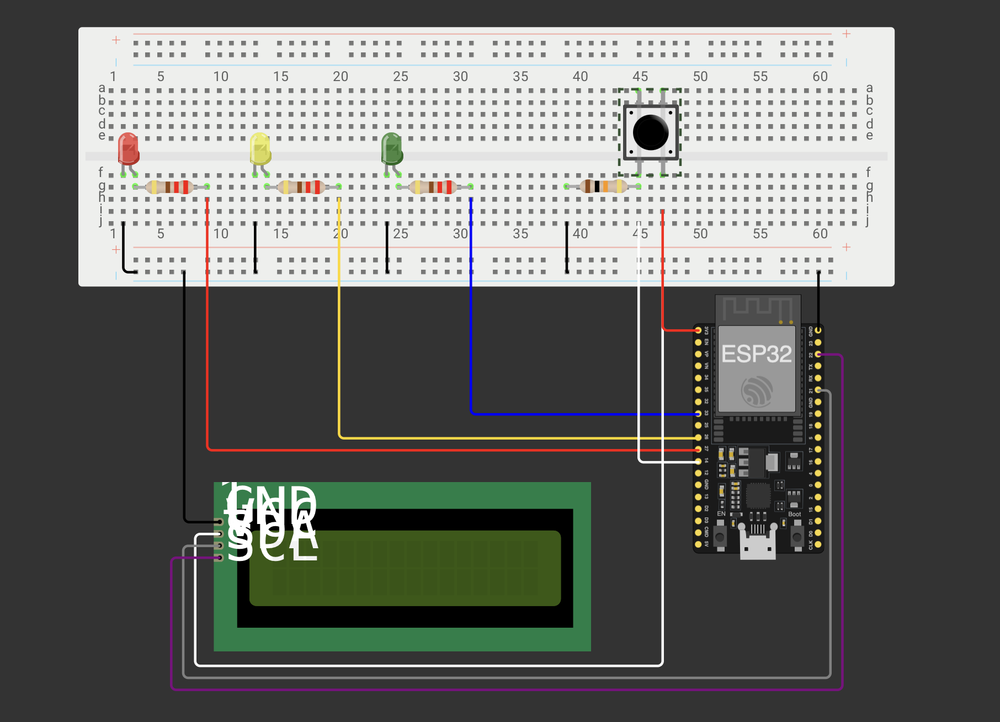
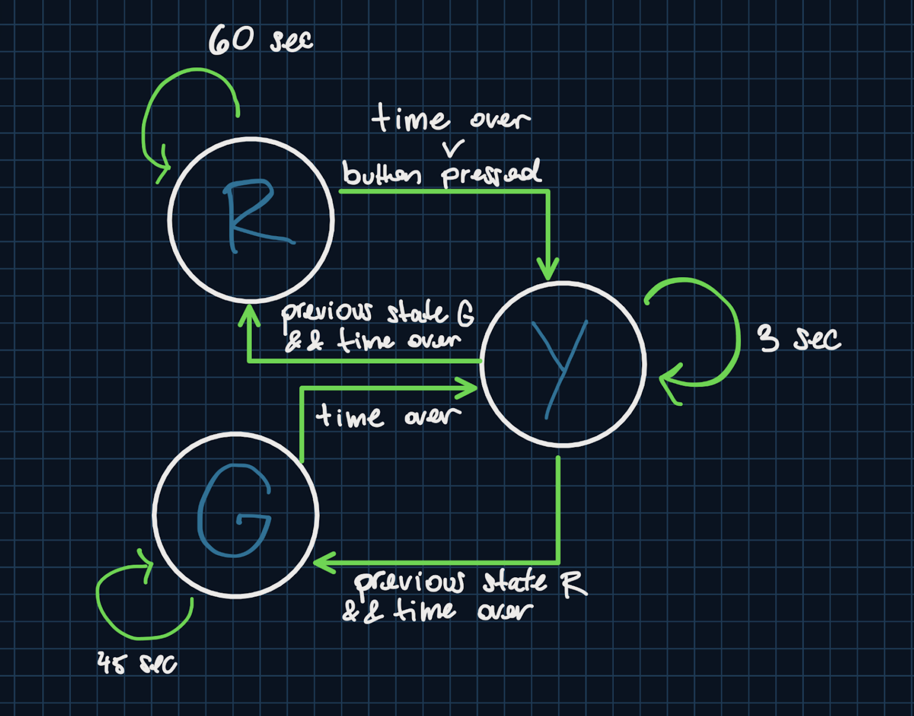
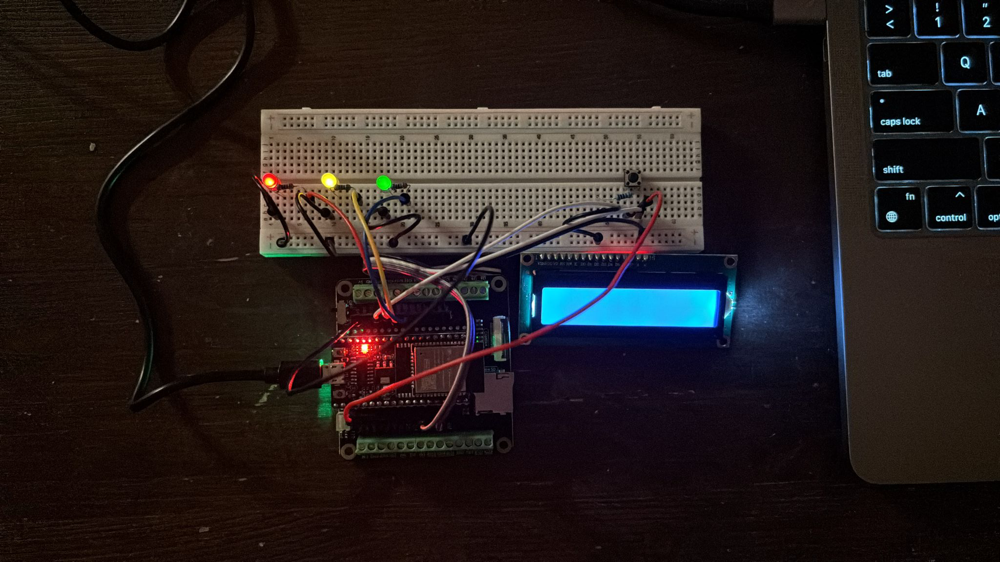
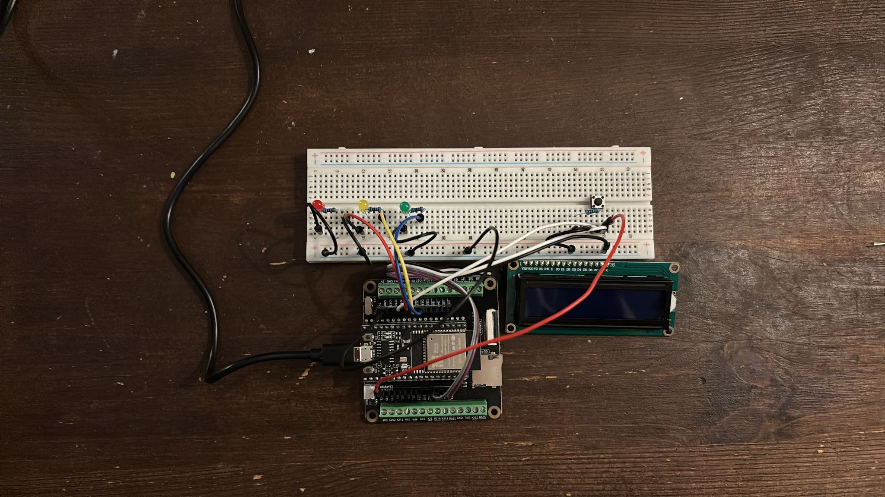

# Smart Traffic Light with ESP32 + LCD + Button

This is my first robotics project, it simulates a smart traffic light controlled by an ESP32 using a finite state machine (FSM). The system includes a 16x2 I2C LCD display for real-time messages and a button that allows users to request the green light.

Take a look at the Demo here: [Demo](https://pinedaangel20.github.io/smart-traffic-light-esp32-lcd-button/demo.html)

## Components Used

- ESP32 Dev Board  
- 16x2 LCD Display with I2C interface  
- Red LED  
- Yellow LED  
- Green LED  
- Push Button  
- Resistors (for LEDs and button)  
- Jumper wires  
- Breadboard  

## How It Works

The traffic light is managed by a finite state machine with three main states: `RED`, `YELLOW`, and `GREEN`. Here's the logic:

- **Initial State: RED**
  - LCD displays “Press for green”.
  - If the button is pressed, a 3-second timer starts before transitioning.
  - If not pressed, it transitions to yellow after 60 seconds.

- **State: YELLOW**
  - Lasts 3 seconds.
  - If coming from RED, it transitions to GREEN.
  - If coming from GREEN, it transitions to RED.

- **State: GREEN**
  - Lasts 45 seconds.
  - Then transitions back to YELLOW.

The LCD updates every second to display the current message and a countdown for the current state.

# Why I Built This

As a Computer Science student, I built this to dive into the world of robotics and embedded systems. My goal was to understand the basics of hardware interaction and get hands-on experience with microcontrollers, timing, and state management.

---

📌 *This project marks the beginning of my robotics portfolio as a Computer Science student. It was built to practice controlling physical systems using microcontrollers and basic electronic components.*
